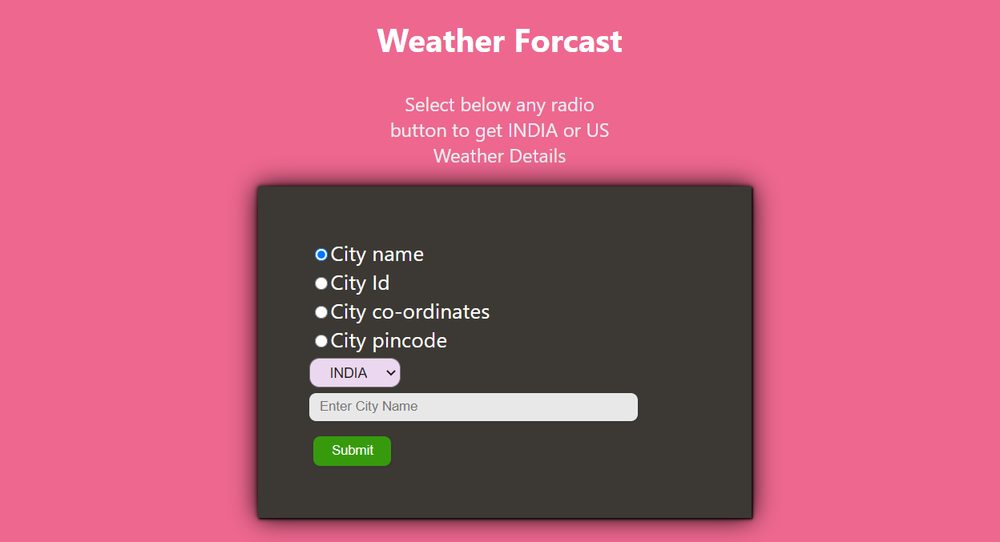
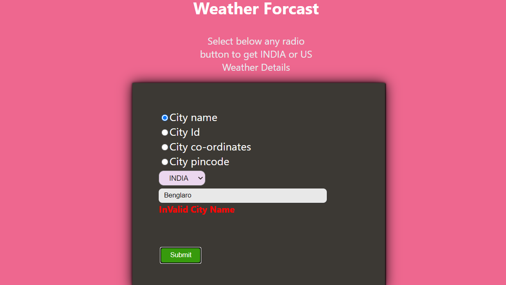
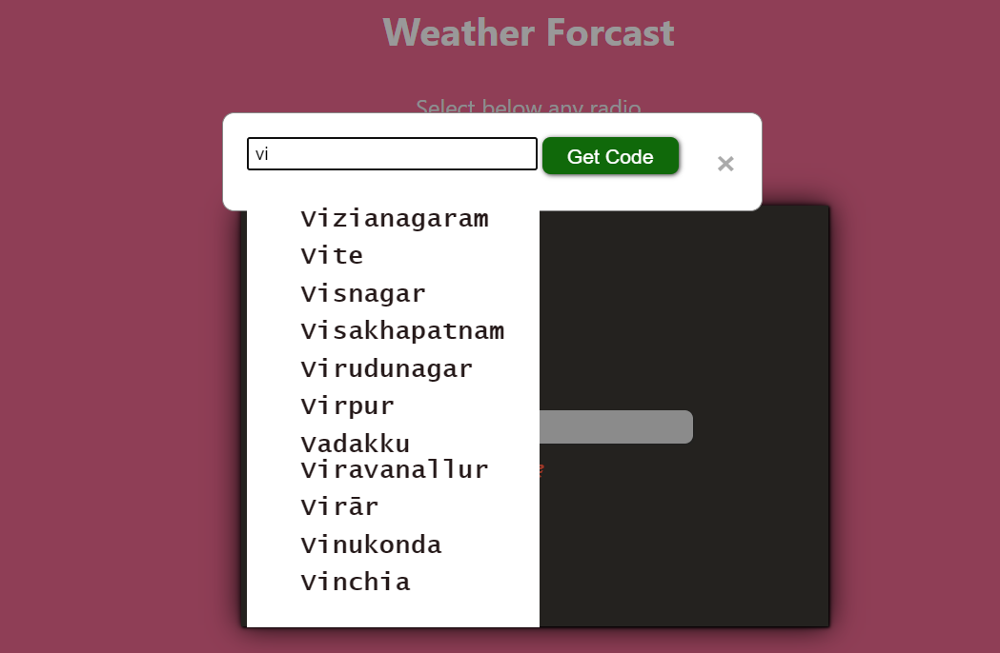
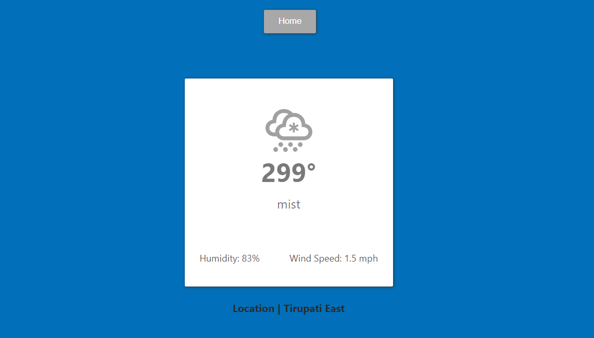
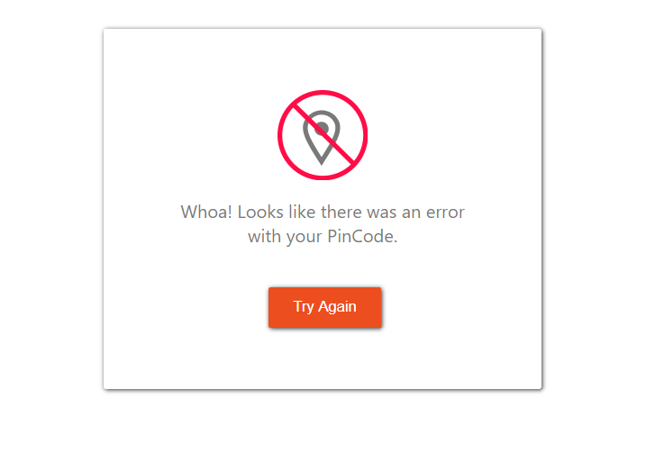

# Weather Detection Application.

#### *** Technologies Used : *** 

```
    1. HTML
    2. CSS
    3. JavaScript.
    4. Server NodeJS(Express).
    5. ReactJS.
	6. Redux
	7. Open Weather (Third Party Api).
```

#### *** Install Packages : ***

``` 
    Move into Proect folder
	
	Move into client Folder:
		Install the Packages : npm i
		Start clinet : npm start
	
	Move into server folder:
		Install the Packages : npm i
		Start server : npm start : npm start

```

### [Live Site(Go to live site and check your city weather reports)](https://main.diw46smwtfc46.amplifyapp.com/)

##### 1. User can select the options below available and fetch the Weather Details
##### 2. Developed Every Component from Scratch.
```
	1. City Name(Either India or US)
	2. City ID (Provided option to Fetch City Id by Providing City Name)
	3. City Latitude and Logitude Co-ordiantes
	4. City Pincode
```

##### Home Screen


##### Realtime User Input Error Detection


##### Get City ID by Providing City Name(Search Suggestion Functionality Added)


##### Weather Data


##### Error Handling for Irrelavent Data Submission

